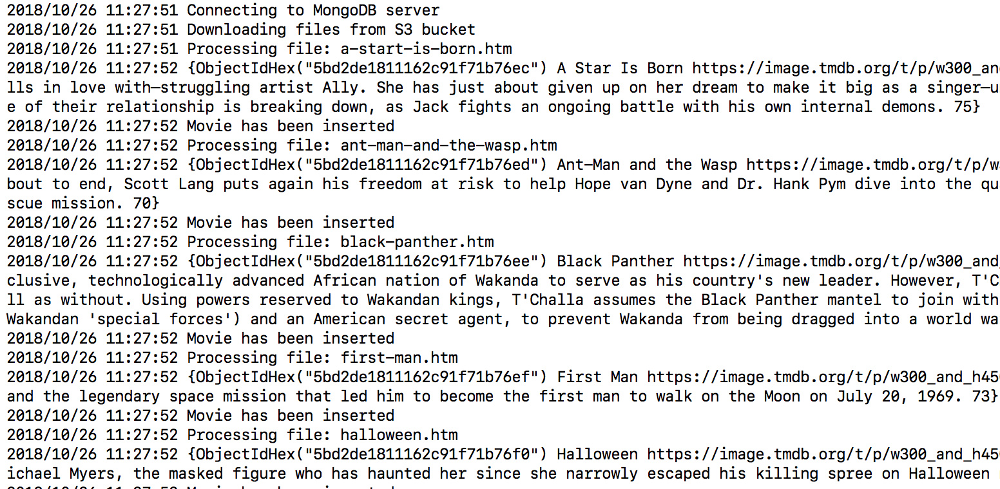
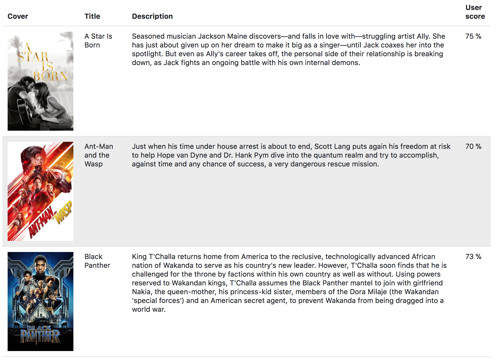

The technical test to apply for a *DevOps Engineer* role at *Foxintelligence* https://foxintelligence.fr/jobs.html

# Requirements

- Golang >= 1.10
- Node.JS >= 8.9.3
- MongoDB >= 4.0

# Configuration

## Backend

### Environment variables

| Variable                              | Description             | Default                            |
| ------------------------------------ | ---------------        | --------------------------------- |
| AWS_ACCESS_KEY_ID                     | Ask recruiter for AWS credentials (IAM role or .aws/credentials file can be used instead) | |
| AWS_ACCESS_SECRET_KEY | Ask recruiter for AWS credentials (IAM role or .aws/credentials file can be used instead) | |
| AWS_REGION | AWS region | eu-central-1 |
| S3_BUCKET | S3 bucket | devops-test-foxintelligence |
| MONGO_URI | MongoDB URI | mongodb://localhost:27017 |
| PORT | Server port | 8080 |

### Usage

```shell
go get
go run main.go
````

## Frontend

### Environment variables

| Varibale                              | Description             | Default                            |
| :------------------------------------ | :---------------        | :--------------------------------- |
| PORT                     | Server port | 3000 |
| BACKEND_URL                     | Backend url | http://localhost:8080 |

### Usage

```shell
npm install
node index.js
```

It should download a set HTML files from an S3 bucket and start parsing them:



Once done, the documents will be inserted to a MongoDB collection, the following is an example of a document inserted:

```json
{
    "_id" : ObjectId("5bd2225811162c782507979f"),
    "title" : "Black Panther",
    "cover" : "https://image.tmdb.org/t/p/w300_and_h450_bestv2/uxzzxijgPIY7slzFvMotPv8wjKA.jpg",
    "description" : "King T'Challa returns home from America to the reclusive, technologically advanced African nation of Wakanda to serve as his country's new leader. However, T'Challa soon finds that he is challenged for the throne by factions within his own country as well as without. Using powers reserved to Wakandan kings, T'Challa assumes the Black Panther mantel to join with girlfriend Nakia, the queen-mother, his princess-kid sister, members of the Dora Milaje (the Wakandan 'special forces') and an American secret agent, to prevent Wakanda from being dragged into a world war.",
    "userscore" : 73.0
}
```

- Point your browser to http://localhost:3000 you should see the following dashboard:



_PS_: Please fork this repo so that you are tested against the test that you started with as this test may change.
